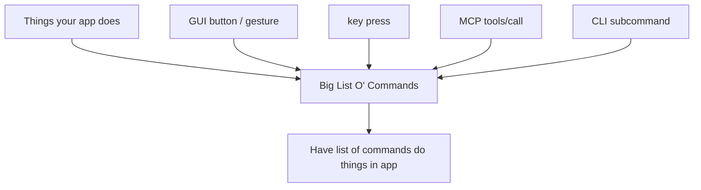
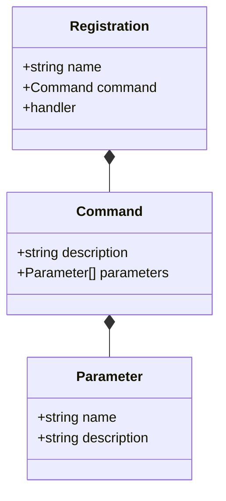
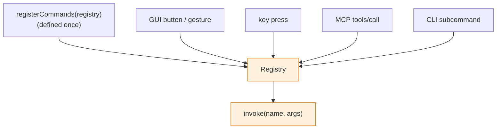

## Introduction

One of the problems I keep having with modern software, especially modern SaaS, is that it doesn't let me do what I want to do with it.
I use a very keyboard-heavy workflow for my daily computer usage. It's a godsend when a piece of commercial software deigns to provide any keymaps at all for working with its software.
However, what if I don't want to use their keymaps? Why can't I just have a file that sets my own, being able to map various commands to keybindings I prefer, like what every programmable editor provides?

This problem got me thinking about any software I build, and what I want to provide for users. In my mind, good UX in software provides sane defaults for normal users, but high levels of extensibility for power users.
A piece of software is just a tool; it is meant to extend the capabilities of the person using it.
Users to be cordoned and funneled into the exact workflow you deem necessary for them. Imagine if MS Excel operated like a modern SaaS onboarding flow.
If I'm building a tool, I want users to be able to use it the way they want to. It's really not that much work, either. If you build the capabilities for this, say, in a library, you can reuse it in other software!
Profound, I know. But my business constraints! But my budget!

So then, what do you need for something like this? You need to know of course what operation the program is performing, and then you'd need a way to map that to a key listening layer.
Let's say you have a program that has some operations like `openSearchMenu` and `createNewItem` and you want to map some keys to it. A place where you can put a list of things like `openSearchMenu` would be nice.

```
"open search menu" -> openSearchMenu(),
"create a new item" -> createNewItem(),
```

Once you have that big list of operations registered somewhere, then you can attach another layer to it for your keys so that they keys point to the commands you want.

```
"cmd + k" -> openSearchMenu,
"cmd + a" -> createNewItem,
```

Then, you wire up your key maps to the key listening API for whatever platform you are writing on.

Something interesting you'll notice, though, is that if we have our big list of operations already set up in the program, then what's stopping us from exposing that as an API to other surfaces?
As I mentioned before, we want to facilitate maximal user capabilities with our software. If we've got all of this stuff exposed, then what if we could build out other ways to work with our program?
Perhaps we could wire up the API to a command line interface library, or even better, what about an MCP server so that people can use agents to work with our program?
If we already have everything organized, why can't we make something that builds all of that out for us?
That brings us to this library, Caelus.

## What is Caelus?

Caelus is a library for building out all these surfaces for an application. It's fundamentally a router at its core. What it allows for a developer to do is wire up their existing application's API to the library's command registry to then be able to construct a CLI, MCP API, and keymapping layer.
Foundationally, Caelus provides a registry, a big list of commands, that a developer uses to hook up their API to the library.
From there, the library provides some adapters to be able to construct and expose the aforementioned surface areas.
It was made initially for desktop applications, but I'm in the process of extending this out to web apps as well as for communicating with back ends.
I prototyped and validated the idea in [Kotlin](https://github.com/ufo-soft/caelus-old), but I've since decided to move it over to TypeScript. I asked Claude Code to port over the [core module](https://github.com/ufo-soft/caelus/blob/main/src/core.ts), and after sufficient amounts of bullying the machine, I think it did a pretty decent job at doing so.

### Core Architecture Overview

This is a very simple library with a few core foundational blocks.

Here's a brief overview before I get into the boring details:

- You've got things your app does
- You put said things into a big list of things your app does
- You look up the things on that list
- You call the things from the list so they do the thing they're supposed to
- You use that list to wire up to other parts of the app
- CLI uses big list, MCP uses big list, etc.



That's pretty much everything you need to know but if you like reading my slop, please continue.

### Core Architecture Pedantry

First, you need a command. A command is a semantic representation of something that the program does.
Next, a command needs parameters to describe what it ingests as arguments. These will become especially important for the CLI. A command has many parameters.
I'm leaving some fields out for now from these classes just so we are only taking a high level overview of the system rather than getting caught up in implementation details.

```
class Command {
    string description
    Parameter[] parameters
}

class Parameter {
    string name
    string description
}
```

That's all well and good, but what do we do now? We have a couple of things that represent what's present, but nothing's happening. Now, we need a place that actually contains the operation from the program.
First, we need a place to actually put the thing that happens in the program, a place to *register* it, so we'll call the container a `Registration`.

```
class Registration {
    string name
    handler
}
```

A `Registration` class holds the handler, which is the operation to be executed. The handler can be anything from a lambda containing just a block of code or a named function. 
It's unopinionated and is set up to work with whatever way the developer has decided to architect their application.
So how does this relate to the `Command` class I showed before? We need to wire the two up by adding a `Command` as a field in the `Registration`.



This way, a `Registration` is a pairing of the semantic information about the thing that runs, and the thing that runs, itself.
You may have guessed by the name of `Registration` that it's registered somewhere. 
Indeed, we have a new class, a `Registry`, where everything gets hooked up, and from which forms the foundation for the useful parts of this library.

```
class Registry {
    Map<string, Registration> registrations
}

class Registration {
    string name
    Command command
    handler
}
```

You'll notice the Registry is a map rather than a list, a map of a string and a Registration. This is so that we can assign a name to a Registration to be able to look it up, but that's getting ahead of ourselves.
The Registry allows for developers to set up what parts of their application gets routed to where.
If a developer has something in their application that opens a search menu, like `openSearchMenu()`, they register it like so:

First, they'd have a command for representing the `openSearchMenu()` operation:
```
searchMenuCMD = new Command(name = "openSearchMenu", parameters = [])
```

Then, we'd add a Registration to wire up the command and the actual operation in the application:
```
searchMenuReg = new Registration(
                        command = searchMenuCMD,
                        handler = openSearchMenu()
                    )
```

All of this is pure pseudocode, slightly Kotlin flavored, but I hope it paints the picture. In this case, the command doesn't need a parameter because `openSearchMenu()` in this context doesn't require any arguments.
If this were different operation, you'd need to add in a parameter, but I'm too lazy to write that out right now, so you'll have to use your imagination.

Finally, we build out the Registry and actually register operations:

```
registry = new Registry(
                registrations = mapOf(
                    "openSearchMenu" -> searchMenuReg,
                    ...
                )
            )
```

That's pretty much it! It's a stupidly simple pattern. Now that we have a place where things get registered, a big list of commands, we can start doing things with it.
Let's say now we want to actually call `openSearchMenu()` from the registry, perhaps from one of the surface contexts I alluded to in the introduction.
We'll need a `retrieve` method to get the operation. How do we retrieve the registration? We use the name key for the Registration value I mentioned earlier.
Cool, but what about actually using the thing? Calling the operation like I mentioned. In that case, we need an `invoke` method. Same method would take in the name and possibly some arguments to pass in for the operation, if it calls for it.
The `invoke` method would then either just directly call the function or dispatch it through some kind of symbolic dispatch. Whatever your language allows. I will be going over this part in later articles.
So, the class ends up looking something like:

```
class Registry {
    Map<string, Registration> registrations
    register(Registration | Registration[])
    retrieve(string) Registration?
    all() Registration[]
    invoke(string, Args) Outcome
}
```

With some extra methods in there because I was too lazy to delete them. You can probably figure out what they do.
A lot of words to describe what is ultimately a very simple router. But things don't need to be complex in order for them to be useful!
I like stupid solutions because they make my grug brain happy.

### What the Caelus Registry Lets Us Do

Like I said earlier, if you have all your operations registered, you can now build out a full API to expose to multiple surfaces.
An adapter for a CLI can now use the Registry to construct commands to parse. A keybinding mapper can map certain keys to Registrations to invoke commands.
You can transform this API into a JSON-RPC layer pretty easily to make an MCP server for agents. I will elaborate on all of these in later articles.



### Why the name?

Caelus is the name of the Roman god of the sky, the equivalent of the Greek Uranus/Oranos, the father of Saturn and grandfather of Jupiter.
What inspired me to choose this name is a handy piece of memory profiling software called [Valgrind](https://valgrind.org/), named after the gate to Valhalla in Norse mythology.
Electing to use a name from mythology harkens back to an older form of programming culture when people would name things based on obscure references, multi-layered jokes, or any other fun thing that came to the programmer's mind.
Software projects now are given these soulless corpo-slop names that are either meant to be cute and/or futuristic, but inoffensive in both cases.
I want any software I use written a sunlight-deprived Gollumesque troglodyte who makes dorky, esoteric references, not some normie making some Ultimate SaaS solution #582 called Boopify.
If your software is made by some basement dwelling, chuddish freak, you know you are in good hands.

## Moving forward

I'm in the midst of actually building this thing out properly. The project has been validated by its prototype, so I know it at least works a little bit. 
It's going to be a TypeScript library first and foremost. Dirty, but it's hard to avoid. There's not much in the way of being ported to any other tech stack, however.
As of the time of writing this, I've only ported the core module over, but I'll most likely get to work building out the keybindings adapter, and surfacing that for web and React Native.
This article was meant to serve as a general overview of the premise and general implementation.
There is a ton of stuff I haven't covered in this article, especially around a lot of technical implementation details. There will be plenty to discuss in future articles.
