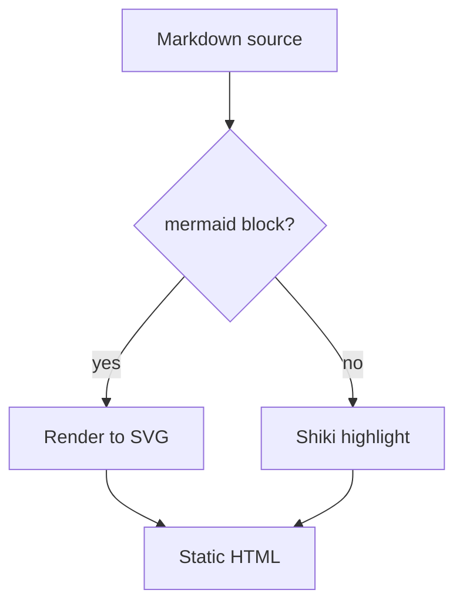
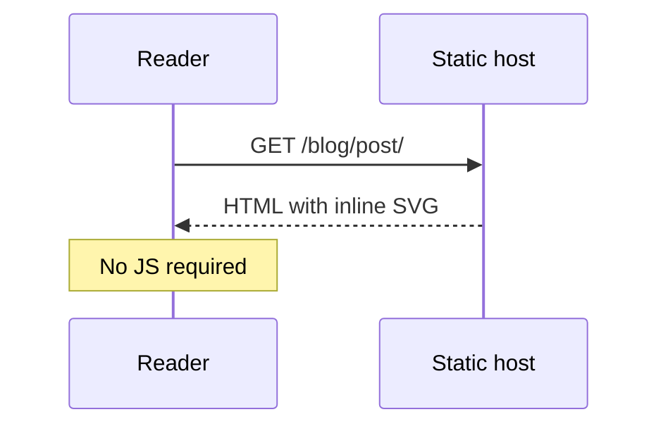

This post exists to exercise post styling. It is marked `draft: true`, so it
stays out of every listing and only builds in dev. The opening paragraph runs
long on purpose — the measure is capped at 620px, and a lede needs enough text
to show where lines actually break and whether `text-wrap: pretty` is doing
anything useful at that width.

A second paragraph, to check the rhythm between them. Body copy carries
**bold for emphasis**, *italic for terms and titles*, `inline code`, a
[link to another page](/contact/), ~~struck-through text~~, and the occasional
[link with `code` inside it](/blog/). Footnote-style markers like H<sub>2</sub>O
and E = mc<sup>2</sup> show up in technical writing often enough to be worth
checking.

## Heading level two

The first `h2` sets the section rhythm. It carries `2.5em` of top margin, which
should read as a clear break without leaving the page feeling gappy.

### Heading level three

An `h3` is body-size and bold — the distinction from surrounding text is weight
and spacing, not scale.

#### Heading level four

`h4` is currently unstyled, so it renders identically to `h3`. Worth deciding
whether posts ever nest this deep, and if so, giving it a treatment.

##### Heading level five

##### And a sixth

###### Heading level six

Two headings in a row, with no text between them, tests whether stacked margins
collapse the way you'd want.

## Lists

An unordered list, with the square accent markers:

- A short item.
- A longer item that wraps to a second line, so the hanging indent is visible
  and it is clear whether the marker stays aligned to the first line.
- An item with **bold**, `code`, and a [link](/).
- A nested list:
  - First child.
  - Second child, which also wraps to a second line to check the nested indent
    and marker placement at depth.
    - And a third level, which is about as deep as anything should go.
- Back to the top level.

An ordered list:

1. First step.
2. Second step, wrapping to a second line to check the tabular-nums alignment
   and the hanging indent against the marker.
3. Third step, with a nested ordered list:
   1. Sub-step one.
   2. Sub-step two.
4. Tenth-item alignment matters once a list gets long.

A list with a longer entry that runs to a full paragraph:

- **Term one.** Some lists carry a bolded lead-in and then a full sentence or
  two of explanation, which makes them read as definition lists in disguise.
- **Term two.** The spacing between items should hold up when each item is
  several lines rather than a fragment.

A task list, which some markdown pipelines render and some do not:

- [ ] Unchecked item.
- [x] Checked item.

## Quotations

> A blockquote, set at lead size in muted ink with an accent rule. Long enough
> to wrap, because a one-line pull quote and a three-line one sit differently
> against the rule.

> A blockquote with multiple paragraphs.
>
> The second paragraph should keep its spacing inside the quote, and the accent
> rule should run the full height of both.
>
> — With an attribution line

## Code

Inline `const x = 1` sits mid-sentence. Below, a fenced block with a language:

```ts
// Syntax highlighting, dual-themed via Shiki.
interface Post {
  title: string;
  pubDate: Date;
  draft?: boolean;
}

export const recent = (posts: Post[], n = 4): Post[] =>
  posts
    .filter((p) => !p.draft)
    .sort((a, b) => b.pubDate.valueOf() - a.pubDate.valueOf())
    .slice(0, n);
```

A block with no language, which gets no highlighting:

```
$ npx astro build
14:22:01 [build] 3 page(s) built in 604ms
```

A block with a long line, to confirm it scrolls horizontally rather than
forcing the page to scroll:

```bash
git log --oneline --graph --decorate --all --date=short --pretty=format:'%h %ad %s%d [%an]' | head -40
```

A shell session with a `#` comment and some output:

```sh
# Clear the content-layer cache
rm -f node_modules/.astro/data-store.json
```

## Diagrams

Mermaid blocks render to SVG at build time, so no diagramming runtime reaches
the browser. A flowchart:



A sequence diagram, which exercises a different renderer:



## Table

| Token             | Value      | Used for                     |
| ----------------- | ---------- | ---------------------------- |
| `--text-micro`    | 10px       | Eyebrows, tags               |
| `--text-caption`  | 12px       | Nav, captions                |
| `--text-body`     | 16px       | Article body                 |
| `--text-lead`     | 19px       | Article lede, `h2`           |
| `--text-title`    | 44px       | Article title                |
| `--text-display`  | 52px       | Landing display              |

A table with more columns than the measure comfortably holds, to check whether
it scrolls or overflows:

| Project | Role | Stack | Year | Status | Notes |
| ------- | ---- | ----- | ---- | ------ | ----- |
| One | Lead | TypeScript, Postgres | 2024 | Active | Ongoing maintenance |
| Two | Contributor | Elixir, Phoenix | 2023 | Archived | Handed off |

---

## Edge cases

A horizontal rule sits above this section.

A very long unbroken string, which is the classic overflow case:
`supercalifragilisticexpialidocious-but-in-kebab-case-and-considerably-longer-than-that`

And a long URL as a bare link:
<https://example.com/a/deeply/nested/path/that/keeps/going/well/past/the/measure/and/then/some>

A line with a hard break at the end,\
followed by the line that break produced.

Keyboard input: press <kbd>⌘</kbd> + <kbd>K</kbd> to open the palette.

An image, which should cap at the measure and keep its aspect ratio:


Finally, a closing paragraph, so the last element before the prev/next nav is
body copy rather than a block element — the bottom spacing reads differently
depending on which it is.
